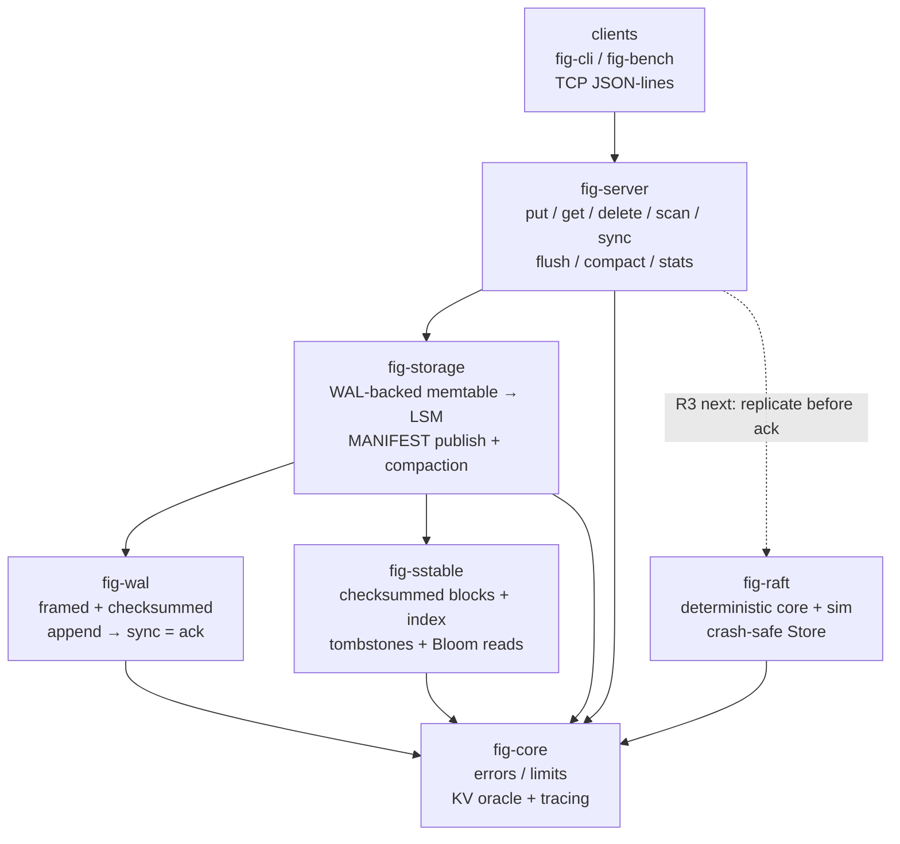

<h1 align="center">FigDB</h1>
<p align="center"><strong>A distributed transactional database built from first principles in Rust.</strong></p>
<p align="center">
  <a href="https://github.com/tmarhguy/figDB/actions/workflows/ci.yml"></a>
  <a href="docs/README.md"></a>
  <a href="docs/testing/inventory.md"></a>
  <a href="#license"></a>
</p>

FigDB implements its storage, consensus, and transaction mechanisms directly —
no RocksDB, no etcd, no Raft library.

Honest status: single-node LSM + TCP server + Raft core through durability are
landed and crash-tested. Server replication wiring and transactions are next,
not here. Full inventory: [docs/architecture/status.md](docs/architecture/status.md).

## Layout



## Quickstart

```bash
cargo run -p fig-server --bin fig-server -- --dir /tmp/fig-srv --addr 127.0.0.1:7001
cargo run -p fig-server --bin fig-cli -- put k1 v1
cargo run -p fig-server --bin fig-cli -- get k1
./scripts/check.sh   # fmt --check + clippy -D warnings + full test suite
```

Durability rule: a write is acked iff it sits at or before the last `sync`.
Details: [docs/architecture/durability.md](docs/architecture/durability.md).

## Docs

Start with [docs/README.md](docs/README.md): [architecture](docs/architecture/overview.md) ·
[status](docs/architecture/status.md) · [durability](docs/architecture/durability.md) ·
[consistency](docs/architecture/consistency.md) · [correctness](docs/correctness/strategy.md) ·
[testing](docs/testing/inventory.md) · [ADRs](docs/adr/README.md).
Full manual: `make docs` (Asciidoctor; output in `build/docs/`), also published
to [tmarhguy.github.io/figDB](https://tmarhguy.github.io/figDB/).

Commits look like `wal: ...`, `core: ...`, `docs: ...` — one piece of work each.

## License

MIT OR Apache-2.0 (matching `Cargo.toml`); license texts land before any public
release. Infrastructure libraries only (Tokio, serde, tracing) — no embedded
database engine.

Database architecture and project by **Tyrone Marhguy**.
